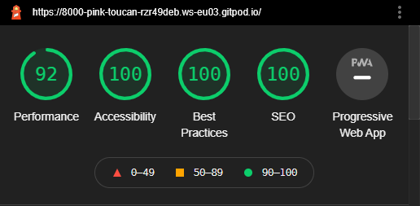

# Harry Potter Sorting Hat

[Here is a link to the final project](https://abibubble.github.io/sorting-hat)

This is a simple randomiser that is Harry Potter themed. It was built for a Harry Potter-themed virtual sleepover for my Guide unit during Covid-19 lockdown restrictions.
It is not fully responsive, as it only needed to be accessible on a laptop screen, for screen sharing via Zoom.

## Contents

* [User Experience (UX)](#user-experience-(ux))
    * [Initial Discussion](#initial-discussion)
    * [User Stories](#user-stories)

* [Design](#design)
    * [Color Scheme](#color-scheme)
    * [Typography](#typography)
    * [Imagery](#imagery)
    * [Wireframes](#wireframes)
    * [Features](#features)

* [Technologies Used](#technologies-used)
    * [Languages Used](#languages-used)
    * [Frameworks, Libraries & Programs Used](#frameworks-libraries-and-programs-used)

* [Deployment](#deployment)
    * [Initial Deployment](#initial-deployment)
    * [How to Fork it](#how-to-fork-it)
    * [How to Clone it](#how-to-clone-it)
    * [Making a Local Clone](#making-a-local-clone)

* [Testing](#testing)
    * [W3C Validator](#w3c-validator)
    * [Testing User Stories](#testing-user-stories)
    * [Full Testing](#full-testing)
    * [Further Testing](#further-testing)
    * [Solved Bugs](#solved-bugs)
    * [Known Bugs](#known-bugs)
    * [Lighthouse](#lighthouse)
        * [Performance](#performance)
        * [Accessibility](#accessibility)
        * [Best Practices](#best-practices)
        * [SEO](#seo)

* [Credits](#credits)
    * [Code](#code)
    * [Content](#content)
    * [Media](#media)
    * [Acknowledgements](#acknowledgements)

---
## User Experience (UX)
### Initial Discussion
My initial requirements for this project was to create a fun, interactive quiz that could be enjoyed by anyone.
My target audience is Harry Potter fans and their friends and family. Luckily, this covers a large part of the population.
The target demographic is incredibly mixed, as Harry Potter is enjoyed by people of all ages and genders.

The main features that I wanted to include are:
* Interactive quiz elements.
* A score counter for correct answers.
* A progress bar so that the user can see how far through the quiz they are.
* Choose your house, and the questions correlate to which house is chosen.
* Audio that can be toggled on and off, which changes depending on which page you're on.
* A timer that ends the quiz if the time runs out.

### User Stories
#### Client Goals
* It needs to be instantly engaging.
* A random house needs to appear every time.
* Manouvering around the site needs to be straightforward.
* The user must be able to return to the homepage from the house page.

#### First Time Visitor Goals
* I want it to be easy to understand what to do.
* I want to be able to easily navigate throughout the site.

#### Returning Visitor Goals
* To be able to get a random house every time

---
## Design
### Color Scheme
* Basic color scheme uses rgb(218,165,32) for the gold (also known as goldenrod) and #07080c for the off-black.

These colors are taken via a color picker tool, directly from the Harry Potter official logo, and from the official Hogwarts crest.

### Typography
* I used sans-serif throughout the quiz. It's a clean and easy to read font, whilst also being bold and eye catching. 
* This font doesn't distract the user from the main theme, and has the added bonus that they're staple fonts with HTML, so all browsers will be able to display them.

### Imagery
* The large background hero image is designed to be striking and catch the user's attention, making it clear at first glance what the quiz is related to. 
* It directly correlates to the aesthetic of the Harry Potter series, using an image of Gloucester cloisters, which was used in the filming of the Harry Potter films.
* The logo used as a header is the official Harry Potter logo.
* The hat image is an artist's cartoon-style version of the sorting hat in the Harry Potter books and movies.

### Wireframes
[Here are the wireframes for desktop, mobile and tablet for this project](wireframes.pdf).

### Features
* A randomised house appears when you click the sorting hat.

---

## Technologies Used
### Languages Used
* [HTML5](https://developer.mozilla.org/en-US/docs/Web/Guide/HTML/HTML5)
* [CSS3](https://developer.mozilla.org/en-US/docs/Archive/CSS3#:~:text=CSS3%20is%20the%20latest%20evolution,flexible%20box%20or%20grid%20layouts.)
* [JavaScript](https://developer.mozilla.org/en-US/docs/Web/JavaScript)

### Frameworks Libraries and Programs Used
#### Font Awesome:
[Font Awesome](https://fontawesome.com/) was used on all pages to add the instructions, home, settings and copyright icons.
#### Git:
Git was used for version control by utilizing the Gitpod terminal to add and commit to Git and push to GitHub.
#### GitHub:
GitHub is used to store the code for this project after being pushed from Git.
#### Balsamiq:
Balsamiq was used to create the wireframes during the design process.
#### Google DevTools:
Google DevTools was used to help me find what code correlated to what feature.
#### Shields.io:
[Shields.io](https://shields.io/) was used to create the GitHub badges for this README.md file.

## Deployment
### Initial Deployment
This site was deployed to GitHub Pages by following these steps:
1. Login or Sign Up to [GitHub](www.github.com).
2. Create a new repository named "sorting-hat".
3. Once created, click on "Settings" on the navigation bar under the repository title.
4. Scroll down to "GitHub Pages".
5. Under "Source", choose which branch to deploy. I chose "master", but this is sometimes shown as "main".
6. Choose which folder to deploy from, usually "/root".
7. Click "Save", then wait for it to be deployed. It can take some time for the page to be fully deployed.
8. Your URL will be displayed above "Source".

### How to Fork it
1. Login or Sign Up to [GitHub](www.github.com).
2. On GitHub, go to [Abibubble/sorting-hat](https://github.com/Abibubble/sorting-hat).
3. In the top right, click "Fork".

### How to Clone it
1. Login or Sign Up to [GitHub](www.github.com).
2. Fork the repository Abibubble/sorting-hat using the steps above in [How to Fork it](#how-to-fork-it).
3. Above the file list, click "Code".
4. Choose if you want to clone using HTTPS, SSH, or GitHub CLI, then click the copy button to the right.
5. Open Git Bash.
6. Change the directory to where you want your clone to go.
7. Type gitclone and then paste the URL you copied in step 4.
8. Press Enter to create your clone.

### Making a Local Clone
1. Log in to [GitHub](www.github.com) and locate the [Repository](https://github.com/Abibubble/sorting-hat) for this quiz.
2. Under the repository name, above the list of files, click "Code".
3. Here you can either Clone or Download the repository.
4. You should clone the repository using HTTPS, clicking on the icon to copy the link.
5. Open Git Bash.
6. Change the current working directory to the new location, where you want the cloned directory to be.
6. Type git clone, and then paste the URL that was copied in Step 4.
7. Press Enter, and your local clone will be created.

For a more detailed version of these steps, go to the [Github Docs](https://docs.github.com/en/github/creating-cloning-and-archiving-repositories/cloning-a-repository#cloning-a-repository-to-github-desktop) page on this topic.

---
## Testing
### W3C Validator
The W3C Markup Validator, W3C CSS Validator and JSHint were used to validate the project to ensure there were no syntax errors within the site.
The only errors found were due to 'let', 'const' and template literals only being available in ES6 within the JavaScript code.

1. W3C Markup Validator
    * [HTML Results](LINK)

2. W3C CSS Validator
    * [CSS Results](LINK)

3. JSHint
    * [JSHint](https://jshint.com/)

### Testing User Stories
#### Client Goals
##### It needs to be instantly engaging.
* The Home page is bright and interesting, with bright colors to draw their eye in, and encourage them to find their house.
* The background image is of Gloucester Cathedral cloisters, which is where the Harry Potter movies were filmed, adding to the immersion.

##### A random house needs to appear every time.
* Every house page is available at random, due to a random number generator that generates a number between 1 and 4.

##### Manouvering around the site needs to be straightforward.
* There are only two clickable areas - the sorting hat, and the back button.
* Both buttons are clear to understand and visible.

##### The user must be able to return to the homepage from the house page.
* On every house page, there is a button to take the user to the home page.

#### First Time Visitor Goals
##### I want it to be easy to understand what to do.
* All instructions are clear and easy to understand.
* All navigation buttons are easy to see and easy to understand what they do.

##### I want to be able to easily navigate throughout the site.
* All instructions are clear and easy to understand.
* All navigation buttons are easy to see and easy to understand what they do.

#### Returning Visitor Goals
##### To be able to get a random house every time
* Every house page is available at random, due to a random number generator that generates a number between 1 and 4.

### Full Testing
* Click on the sorting hat to navigate to a random house page.
* Click the back button to return to the original page.
* Ensure that every house page is available. This was done by repeatedly clicking the sorting hat.
* Ensure that the house pages are shown at random.

#### Desktop / Laptop
1. Google Chrome
    * All tested and working correctly.

2. Microsoft Edge
    * All tested and working correctly.

3. Mozilla Firefox
    * All tested and working correctly.

4. Internet Explorer
    * All tested and working correctly.

5. Safari
    * All tested and working correctly.

### Further Testing
The website was tested on Google Chrome, Firefox, Internet Explorer, Microsoft Edge, Safari and Samsung Internet browsers.
The website was viewed on a variety of devices, including:
* Custom built desktop PC, running Windows 10
* Acer Aspire V Nitro Laptop, running Windows 10
* Lenovo B51 IntelCore i7 Laptop, running Ubuntu 16.04 LTS
* MacBookAir7,2 (13-inch, 2017)

A large amount of testing was done to ensure that all pages were visible or hidden correctly, all buttons worked as they should, and the quiz played out as it should.
Friends, family members, and other developers were asked to review the site and documentation to point out any bugs and/or user experience issues that they came across.

### Solved Bugs
1. The sortHouse() function was returning numbers 0 - 3, instead of 1 - 4.
    * I checked the function of Math.random() and Math.floor(), and realised it rounds the number down.
    * I fixed this by adding 1 to the number at the end.
    * I am aware that I can use Math.ceil() instead, and will correct this when I have more time.

### Known Bugs
* This site is not responsive for mobile or tablet devices. This was simple done as I needed to get it completed quickly in time for the event I used it for, and will be fixed in the future.
* The code needs shortening in the sortHouse() function as mentioned in solved bugs #1.

### Lighthouse
I tested my website using DevTools Lighthouse feature, and got these results:

#### Desktop

#### Performance:
* I decided to use vanilla CSS and JavaScript, rather than utilising Bootstrap or jQuery due to the performance trade-offs caused by those libraries.
* I was very happy with my initial lighthouse score, as the only thing reducing my Performance is that I have quite a few images, including an image being used as the background on all pages.

#### Accessibility:
* I was very careful when writing my code to ensure it was fully accessible.
* I used semantic code wherever possible to help any users that use screen readers.
* Every image has relevant alt text, including the images that are populated depending on the result.
* All text has good visibility on whichever background it's on, so it shouldn't cause issues for any color blind users.
* I also checked this site with a friend who has Deuteranopia color blindness, and he had no issues with the site.

#### Best Practices:
* As I avoided code libraries, I also avoided any security vulerabilities associated with those libraries.
* Images are shown with the correct aspect ratio, as all resizing is done with percentage values instead of pixel values.
* As the site is a quiz, it also doesn't ask for any geolocation or notification permissions.

#### SEO:
* I ensured the site has a relevant meta description and a relevant title.
* All font sizes are legible on all screen sizes, and all tap targets are well sized.

---
## Credits
### Code
* [Font Awesome](https://fontawesome.com/): Library of icons used for social media and download links.

### Audio
* There is no audio in this site.

### Content
* All other text content written by the developer, Abi Harrison.
* All other code was written by the developer, Abi Harrison.
* [Colour picker](https://imagecolorpicker.com/en/).
* Background photo on Homepage by Devon Cartwright-Smith from [FreeImages](https://freeimages.com/).
* [Harry Potter logo](https://commons.wikimedia.org/wiki/File:Harry_Potter_wordmark.svg).
* https://www.pinterest.co.uk/pin/716142778224412690/ for sorting hat image by Fábio Baganha.
* FIND LINK FOR HOUSE CREST IMAGES

### Media
* All media belongs to J.K. Rowling & Warner Bros Entertainment Inc.
* All characters, quotes, and themes belong to J.K. Rowling & Warner Bros Entertainment Inc.
* All images used were copyright free images, with credit given in Content above.

### Acknowledgements
* Eve Crabb, for her support through my learning, and for being a sounding board for bug fixes.
* Tom Crabb, for his advice on how to make my code cleaner.
* The team at [Code Institute](https://codeinstitute.net/), for teaching me the necessary skills to create this site.
* Conor Nye for his continuous support throughout my coding journey.